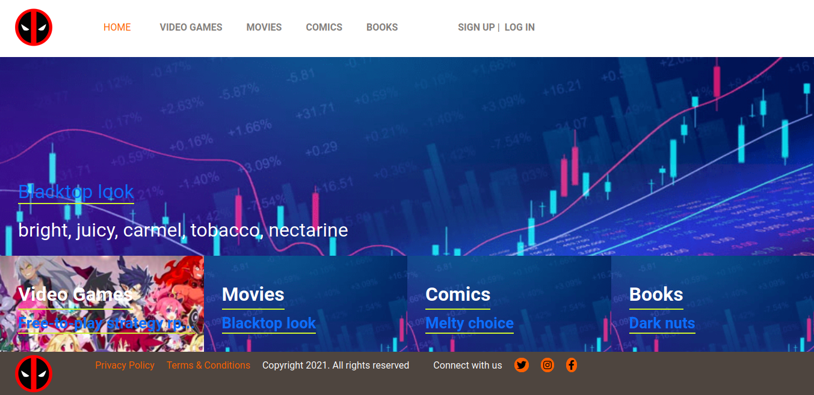

<!-- TABLE OF CONTENTS -->
## Table of Contents

* [About the Project](#about-the-project)
  * [Built With](#built-with)
  * [Walkthrough Video and Deployment (Heroku)](#walkthrough-video-and-deployment-(heroku))
* [Usage](#usage)
* [Database Structure](#database-structure)
* [Contributors](#contributors)
* [Acknowledgements](#acknowledgements)
* [License](#license)

<!-- ABOUT THE PROJECT -->
## About The Project

This is the Capstone project that signs the completion of the RubyOnRails module in Microverse Curriculum.
It is a web app where users can register and create content.
As a logged in user, it is possible to create articles and vote on articles.
The app can be used also on read only mode, with restricted access to its features.



### Built With
This project was built using these technologies.
* Ruby & Ruby on Rails
* Rspec / Capybara
* Bootstrap
* HTML / CSS / SCSS
* PostgreSQL
* Rubocop

<!-- Live Demo -->
## Walkthrough Video and Deployment (Heroku)
link goes here
##
* Live Demo Link --> App Deployed with Heroku: [rails-capstone](#) :point_left:

### Getting Started

To get a local copy up and running follow these simple example steps.

### Prerequisites

Ruby: 3.3.0
Rails: 6.1.3.1

### Clone
* [download zip link](https://github.com/JohnHernCode/Rails-Capstone/archive/refs/heads/develop.zip) or clone this repo:
  - Clone with SSH:
  ```
    git@github.com:JohnHernCode/Rails-Capstone.git
  ```
  - Clone with HTTPS
  ```
    https://github.com/JohnHernCode/Rails-Capstone.git

### Setup

Install gems with:

```
$ bundler install --without production
```

Setup database with:

```
$ rails db:migrate
$ rails db:seed
```

### Usage

Start server with:

```
$ rails server
```

Open `http://localhost:3000/` in your browser and click sign up to create a new user.
- for any technical problems running ```rails db:migrate:reset && rails db:seed``` should solve it

#### Create User

Fill the sign up form to create a user


#### Login


#### Create a new article from the menu

Type your title and text, add an image, and category


  ## Automated Test

* Run the command and see the output: 
```$ bundle exec rspec```


## Database Structure
 * Database schema used for this project reflects the following structure:
 
 
 ## Potential future features
- Extend the signin / signup process to social accounts, use verfied email process
- Improve the front-end

<!-- CONTACT -->
## Contributors

👤 **John Hernandez**

- GitHub: [@johnhernandez-code](https://github.com/johnhernandez-code)
- Twitter: [@JohnHernCode](https://twitter.com/JohnHernCode)
- LinkedIn: [John Hernandez](https://www.linkedin.com/in/john-hernandez-56a7821b8/) 

## :handshake: Contributing

Contributions, issues and feature requests are welcome!

Feel free to check the [issues page](https://github.com/JohnHernCode/Rails-Capstone/issues).

## Show your support

Give a :star: if you like this project!


<!-- ACKNOWLEDGEMENTS -->
## Acknowledgements
* [Microverse](https://www.microverse.org/)
* [Ruby Documentation](https://www.ruby-lang.org/en/documentation/)
* [Ruby on Rails](https://rubyonrails.org/)
* [Bootstrap](https://getbootstrap.com/)
* [Behance](https://www.behance.net/)
* [Heroku](https://www.heroku.com/)

## Credits
* Nelson Sakwa - [liFEstIye](https://www.behance.net/gallery/14554909/liFEsTlye-Mobile-version)

## 📝 License

This project is [MIT](https://opensource.org/licenses/MIT) licensed.
